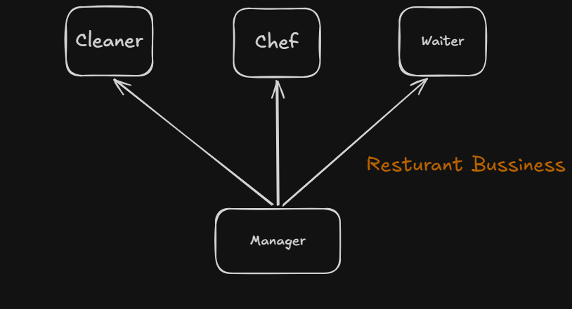

Without using OOP, as we go towards complex projects-
the code with procedural programming starts to have more complexity and 
we cannot understand what is really going on in the code because there are 
so many relationships between different variables so HERE comes OOP==

IN OOP: A large project is divided into Modules so we can tackle each one in order to get things done, it also helps if we use them in other projects.

Example:
 Imagine running a resturant bussiness- in procedural programming you 
have to manage all things at the same time and it becomes very complex but using OOP, you can make modules such as:
--Waiter can do its own role
--chef know how to cook
--cleaner has role in cleaning,
                               you can see here: 

IN OOP, we model real world objects
Class: Blueprint of model from which objects can be made or drawn
Objects: Actual model which we can use in code
